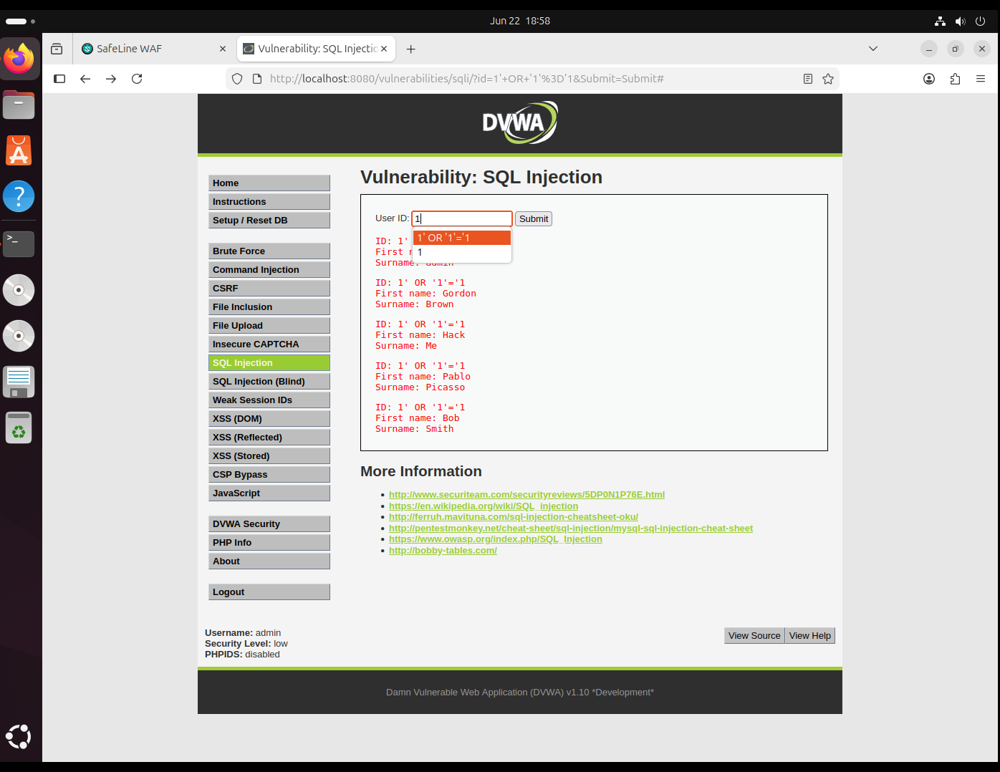
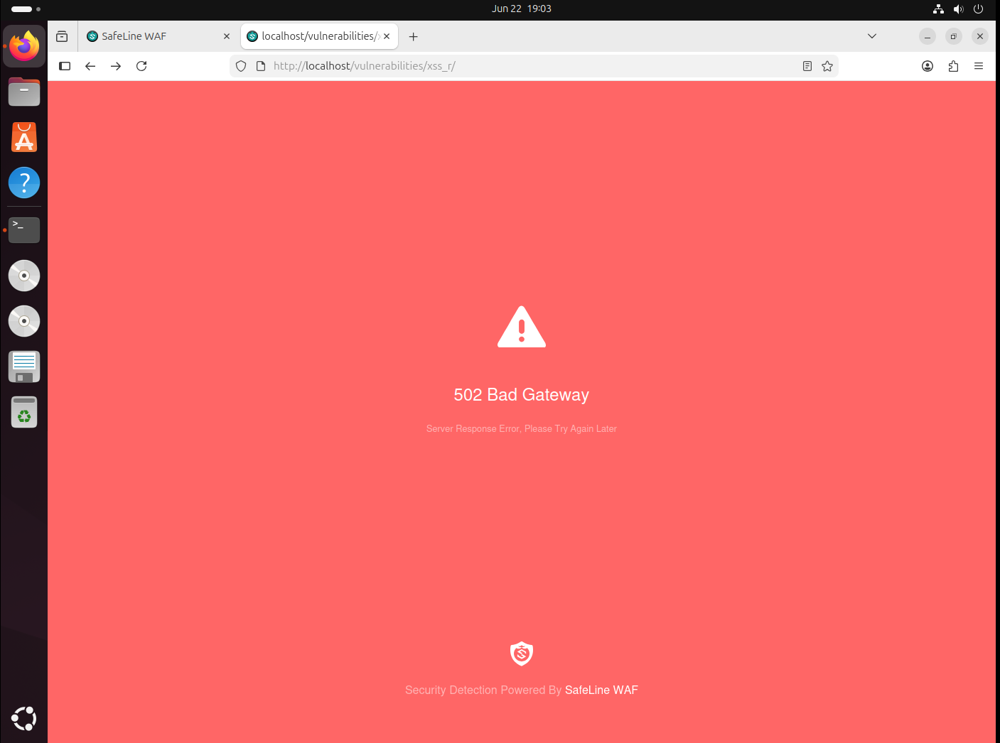
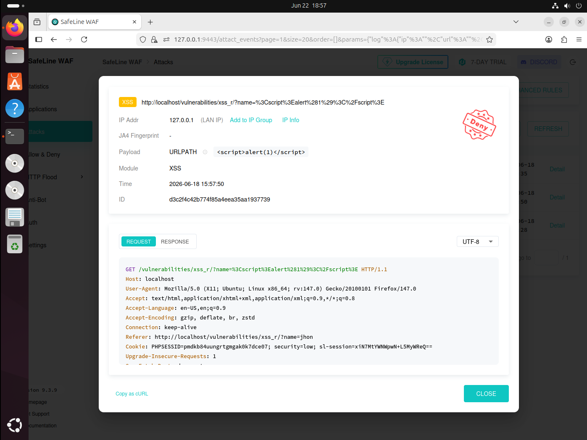
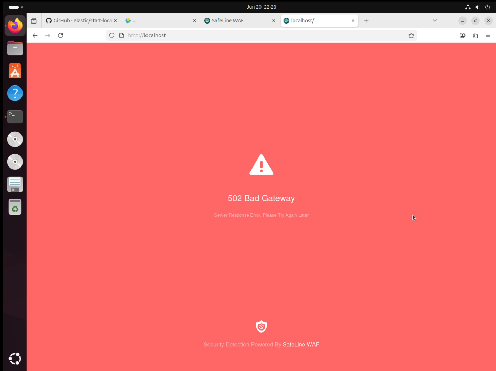
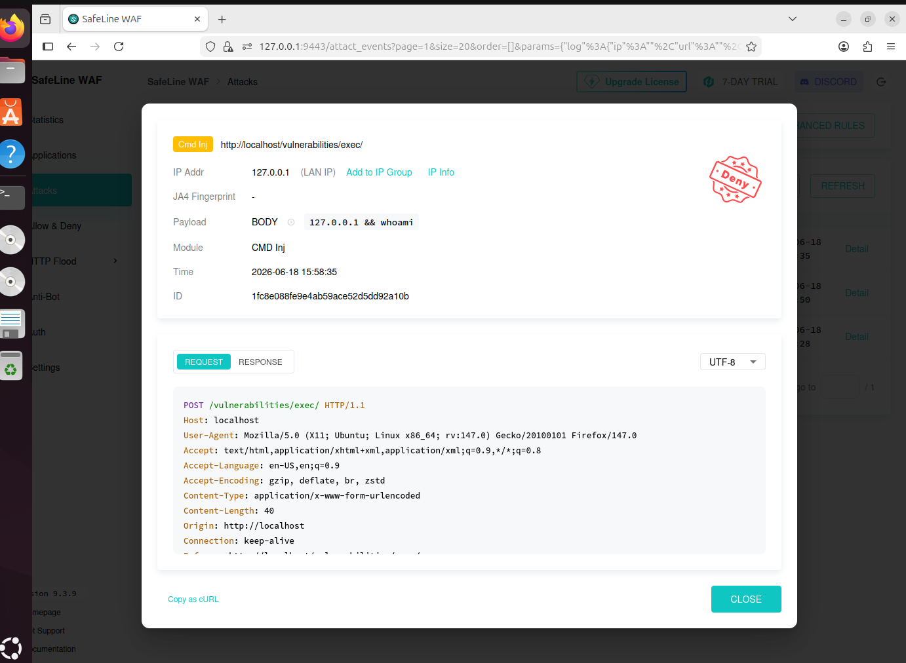
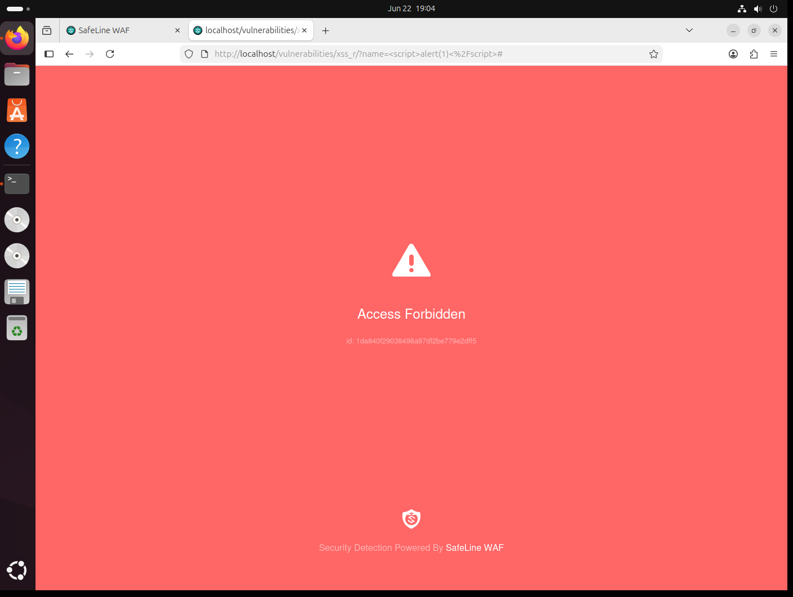
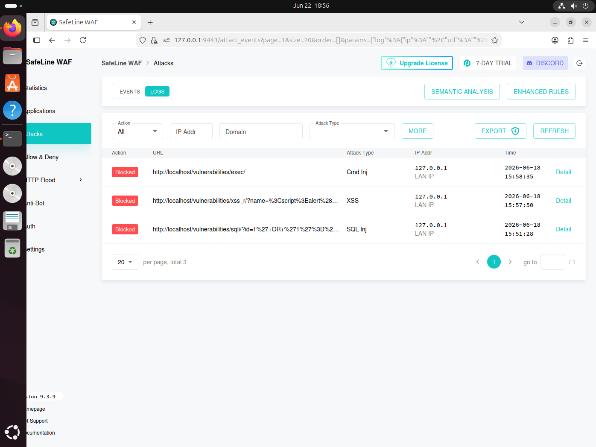

# 🛡️ SafeLine WAF Security Validation Lab


---

## 📌 Overview

This project demonstrates the **deployment and validation of SafeLine Web Application Firewall (WAF)** using **DVWA (Damn Vulnerable Web Application)** in a controlled cybersecurity lab environment.

The objective was to evaluate SafeLine WAF's ability to **detect, log, and block** common web application attacks defined in the **OWASP Top 10**.

---

## 🧰 Technologies Used

| Tool | Purpose |
|------|---------|
| Ubuntu Linux | Host Operating System |
| Docker | Container Runtime |
| SafeLine WAF | Web Application Firewall |
| DVWA | Vulnerable Target Application |
| Firefox Browser | Attack Simulation Client |

---

## 🏗️ Lab Architecture

```
┌─────────────────────────┐
│     Attacker Browser    │
│  (Firefox + Payloads)   │
└────────────┬────────────┘
             │  HTTP Request
             ▼
┌─────────────────────────┐
│      SafeLine WAF       │
│  (Docker - Port 80/443) │
│  Detects & Blocks Attacks│
└────────────┬────────────┘
             │  Clean Traffic Only
             ▼
┌─────────────────────────┐
│          DVWA           │
│  (Docker - Port 8080)   │
│  Vulnerable Web App     │
└────────────┬────────────┘
             │
             ▼
┌─────────────────────────┐
│        Database         │
│      (MySQL/MariaDB)    │
└─────────────────────────┘
```

---

## ⚙️ Setup & Installation

### Prerequisites
- Ubuntu Linux (20.04 or later)
- Docker & Docker Compose installed

### Step 1 — Install Docker

```bash
sudo apt update
sudo apt install -y docker.io docker-compose
sudo systemctl enable docker
sudo systemctl start docker
```

### Step 2 — Deploy SafeLine WAF

```bash
# Download and run SafeLine installer
bash -c "$(curl -fsSLk https://waf.chaitin.com/release/latest/setup.sh)"
```

### Step 3 — Deploy DVWA

```bash
docker run -d \
  --name dvwa \
  -p 8080:80 \
  vulnerables/web-dvwa
```

### Step 4 — Configure SafeLine

1. Open SafeLine dashboard → `http://localhost:9443`
2. Add DVWA as a protected site (upstream: `http://localhost:8080`)
3. Set SafeLine to listen on port `80`
4. Enable protection mode: **Observation → Prevention**

---

## 🎯 Attack Scenarios & Results

### 1️⃣ SQL Injection

**Payload Tested:**
```sql
' OR '1'='1
```

**Result:**
| Check | Status |
|-------|--------|
| Attack Detected | ✅ Yes |
| Attack Logged | ✅ Yes |
| Request Blocked | ✅ Yes |

#### SQL Injection Test — DVWA Input



#### SQL Injection Detection — SafeLine Dashboard



---

### 2️⃣ Cross-Site Scripting (XSS)

**Payload Tested:**
```html
<script>alert(1)</script>
```

**Result:**
| Check | Status |
|-------|--------|
| Attack Detected | ✅ Yes |
| Attack Logged | ✅ Yes |
| Access Denied | ✅ Yes |

#### XSS Test — DVWA Input



#### XSS Blocked — SafeLine Response



---

### 3️⃣ Command Injection

**Payload Tested:**
```bash
127.0.0.1 && whoami
```

**Result:**
| Check | Status |
|-------|--------|
| Attack Detected | ✅ Yes |
| Attack Logged | ✅ Yes |
| Execution Prevented | ✅ Yes |

#### Command Injection Test — DVWA Input



#### Command Injection Blocked — SafeLine Response



---

### 📊 SafeLine WAF Attack Logs

All three attack attempts were captured and logged in the SafeLine dashboard with full request details, source IP, attack type, and timestamp.



---

## 📈 Findings & Analysis

| Attack Type | Detected | Blocked | Logged |
|-------------|----------|---------|--------|
| SQL Injection | ✅ | ✅ | ✅ |
| Cross-Site Scripting (XSS) | ✅ | ✅ | ✅ |
| Command Injection | ✅ | ✅ | ✅ |

**Key Observations:**
- SafeLine successfully detected all three OWASP Top 10 attack vectors.
- Malicious requests were blocked before reaching DVWA backend.
- Detailed attack logs were generated in real-time with payload visibility.
- Zero false positives observed during normal traffic simulation.
- SafeLine dashboard provided clear visibility into all intercepted threats.

---

## 🧠 Skills Demonstrated

- Web Application Security (OWASP Top 10)
- WAF Deployment & Configuration
- Linux System Administration
- Docker Containerization
- Security Monitoring & Log Analysis
- Threat Detection & Incident Analysis
- Attack Simulation & Validation
- Network Traffic Analysis

---

## ✅ Conclusion

This lab successfully validated **SafeLine WAF's capability** to detect, log, and block multiple OWASP Top 10 attack vectors — specifically SQL Injection, Cross-Site Scripting, and Command Injection — in a controlled environment.

SafeLine demonstrated **100% detection and blocking rate** across all tested payloads, confirming its effectiveness as a self-hosted WAF solution for protecting web applications.

---

## 📁 Repository Structure

```
SafeLine-WAF-Security-Validation-Lab/
├── README.md
└── Screenshots/
    ├── 01-SQLi-Test.png
    ├── 02-SQLi-Detection.png
    ├── 03-XSS-Test.png
    ├── 04-XSS-Blocked.png
    ├── 05-CMDi-Test.png
    ├── 06-CMDi-Blocked.png
    └── 07-WAF-Logs.png
```

---

> ⚠️ **Disclaimer:** This project was conducted in a controlled lab environment for educational purposes only. All attacks were performed against intentionally vulnerable software (DVWA). Do not attempt these techniques on systems you do not own or have explicit permission to test.
